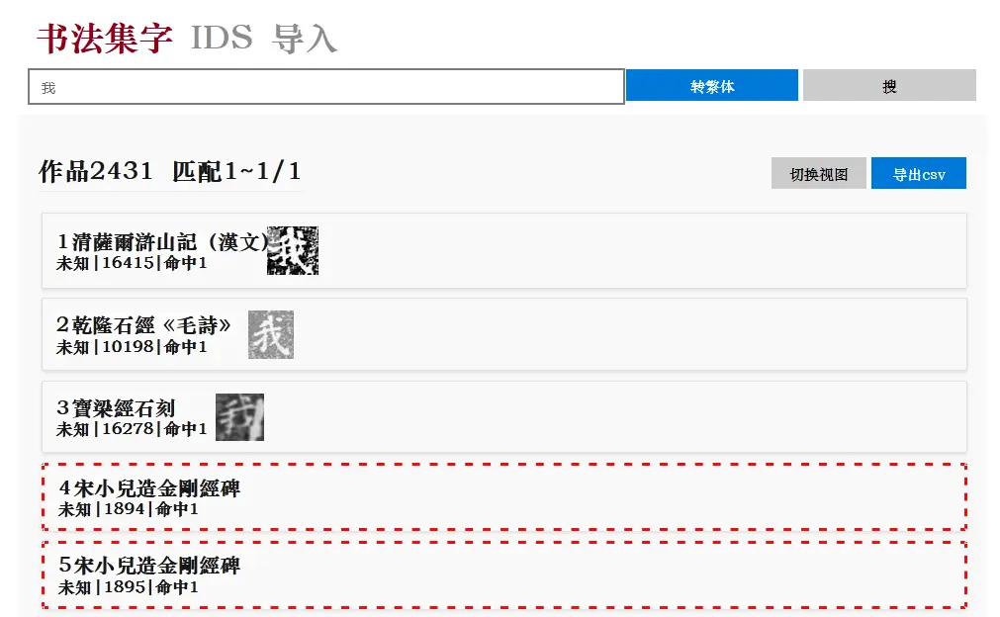

# Chinese Calligraphy Collection Program

# 书法集字程序

本程序能够从书法作品数据中快速检索出现了你需要汉字的书法作品。

## 安装说明

1. 你需要`>=python3.8`来运行后端
2. 后端依赖项在`src/back/requirements.txt`
3. 前端在https://github.com/ZzzzzzzSkyward/CalligraphyCollect/releases 下载，下载解压到`src/back/dist`。你也可以自己在`src/front/`目录下打包`npm run build`。
4. 京都大学图片数据（`src/back/data/images`）下载地址是https://pan.baidu.com/s/1vySO6pTk9X6MzHaQgWdZsw?pwd=call 